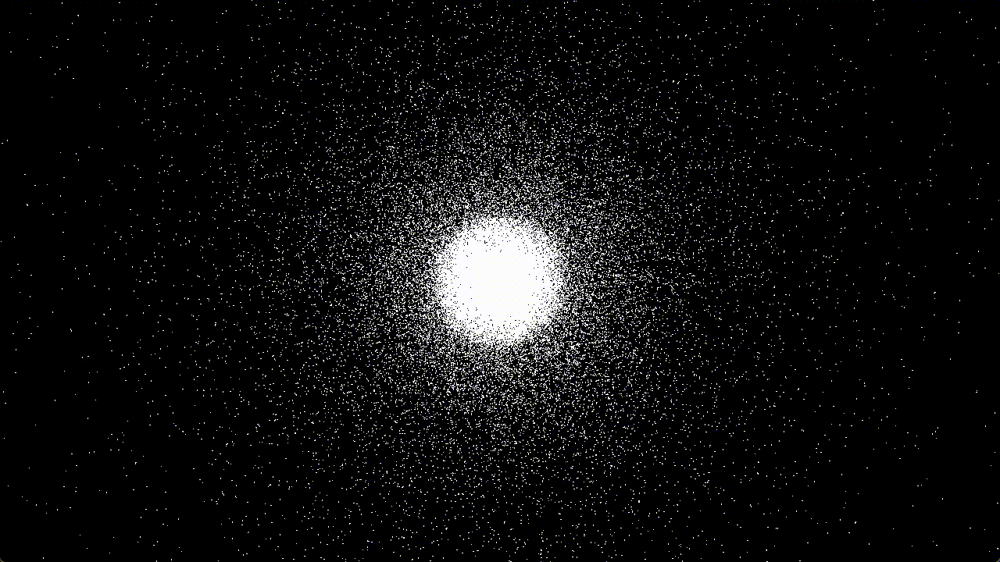

# n-body-sim

A real-time n-body simulation written in C++, featuring both CPU and GPU backends to simulate gravitational interactions between multiple bodies. Below is a demonstration of this simulation, showing 100,000 bodies rendered in real-time on the GPU as they form a Plummer sphere:



## Overview

This project implements an n-body simulation for bodies interacting via gravitational force. It provides an integrator for solving the n-body problem numerically in C++, implemented for both the CPU and the GPU. On the CPU, the integrator is multi-threaded and further accelerated using the Barnes-Hut algorithm. On the GPU, the integrator is implemented via compute shaders in OpenGL 'naively' using the all-pairs algorithm. The visualization of all bodies is performed in real-time by rendering them as circles using OpenGL.

The goal of this project was not to implement the most performant or exhaustive n-body simulation available, but rather to experiment with features introduced in more recent versions of C++ and OpenGL. Examples include ranges and concepts in C++ as well as direct state access (DSA) and persistent mapping in OpenGL. Consequently, these features are sometimes used in situations where they might seem 'too much'.

More information about this project can be found in the [documentation](docs/documentation.md).

### Key Features

- Real-time visualization using OpenGL.
- Symplectic velocity Verlet integrator for long-term stability.
- Predefined configurations:
  - Euler's collinear 3-body problem.
  - Lagrange's periodic 3-body problem.
  - Plummer's n-body model for spheres.
- Two simulation backends:
  - **CPU**: Multi-threaded implementation with the Barnes-Hut algorithm for $O(n \log n)$ complexity.
  - **GPU**: All-pairs algorithm using tiled computations via compute shaders.

## Getting Started

### Prerequisites

To build this project, you will need:
- A C++ compiler supporting C++23.
- CMake 4.0.0 or newer (with a supported build tool such as Ninja or Make).
- A GPU supporting OpenGL 4.6.
- vcpkg
- git

The default build settings use Clang as the C++ compiler and Ninja as the build tool. However, this can be changed either by adapting `CMakePresets.json` or creating a user-specific `CMakeUserPresets.json`.

### Building and Running

1. Clone the repository:
   ```bash
   git clone https://github.com/artdien/n-body-sim.git
   cd n-body-sim
   ```

2. Build the project (this will automatically download all necessary dependencies via vcpkg):
   ```bash
   export VCPKG_ROOT="/path/to/vcpkg"
   cmake --workflow release # alternatively: cmake --workflow debug
   cmake --build build
   ```

3. Run the simulation:
   ```bash
   # Arguments are optional, default values (shown here) are used if omitted.
   ./build/src/n-body-sim -width 1920 -height 1080
   ```

### Usage

Launching the application opens a window and immediately starts a CPU-based simulation. The initial window size can be specified via command-line arguments as shown above.

By default, the simulation initializes with 1,000 bodies using the Plummer model on the CPU. When switching to three-body configurations, you may wish to adjust the parameters, e.g. increasing the time step for a faster simulation or decreasing the frustum size to better observe the bodies.

The general controls are:

- **Mouse Wheel**: Zoom in or out.
- **Left Mouse Button (Click and Hold)**: Move the view frustum.
- **Key 'ESC'**: Close application.
- **Key 'm'**: Toggle the menu.

The menu settings are:

- *Rendering* (changes apply immediately):
  - **Body Radius**: Size of each body relative to the view frustum.
  - **Frustum Size**: Diameter of view frustum.
  - **Frustum Origin**: Center point of view frustum.
- *Simulation* (changes apply only to new simulations):
  - Radio buttons to toggle between **CPU** and **GPU**.
  - **Configuration Type**: Select a specific n-body configuration.
  - **Configuration Radius**: The radius used in special configurations.
  - **Mass Of Each Body**: Set the uniform mass for all bodies.
  - **Number Of Bodies**: Total number of bodies (applicable only to Plummer model).
  - **Gravitational Constant**: The value of $G$.
  - **Time Step**: The size of time step $dt$.
  - **Softening Factor**: Applied to simulations for preventing 'slingshot' effects.
  - *CPU specific* (visible only when **CPU** is selected):
    - **Use Barnes-Hut**: Toggle between the Barnes-Hut algorithm and the all-pairs fallback.
    - **Theta**: The accuracy threshold for the Barnes-Hut algorithm.
    - **Thread Count**: Number of threads allocated for simulation.
  - *GPU specific* (visible only when **GPU** is selected):
    - **Dispatch Size**: Number of work groups dispatched for compute shaders. 
    - **Tile Size**: The size of tiles processed by each work group.
- Button **Create New Simulation** to apply the current simulation parameters and start a new simulation.

### Dependencies

This project uses the following dependencies, managed via vcpkg:

* [GLM](https://github.com/g-truc/glm): Used for linear algebra and vector mathematics, providing an API closely aligned with GLSL.
* [GLFW](https://github.com/glfw/glfw): Used for window creation and the handling of keyboard and mouse input.
* [glad](https://github.com/dav1dde/glad): An OpenGL loader used to access modern function pointers.
* [Dear ImGui](https://github.com/ocornut/imgui): Used to implement a menu, allowing for the adjustment of simulation parameters and rendering settings.

## License

Distributed under the MIT License. See [LICENSE](LICENSE) for more information.
